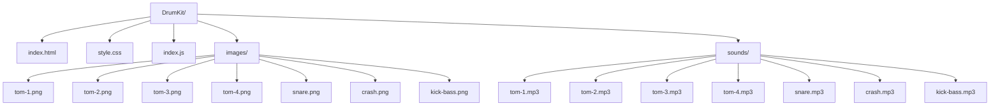

# 🥁 Drum Kit Game

A fun and interactive virtual drum kit built using **HTML**, **CSS**, and **JavaScript**. Hit your keyboard keys and start drumming!

---

## 🚀 Live Demo

👉 [Play it here!](https://natthy2023.github.io/browser-game-jam/Drum-Kit/)

---

## 🛠️ Built With

---

## 🎮 Features

- Click buttons or press keyboard keys to play drum sounds.
- Realistic drum sound effects.
- Animated feedback for each key press.
- Fully responsive and mobile-friendly.

---

## 🧠 How It Works

- Each button corresponds to a specific key.
- Pressing a key triggers a JavaScript event that plays a sound.
- CSS animations give a real-time pressed effect.

---

## 📁 Folder Structure

 
📁 Click to view Mermaid Diagram

## 👤 Author

**I'm NADX**  
🔗 [Telegram](https://t.me/nisimp)  
📧 natnaelasfaw2023@gmail.com

---

## 📜 License

This project is open source and free to use under the [MIT License](LICENSE).

