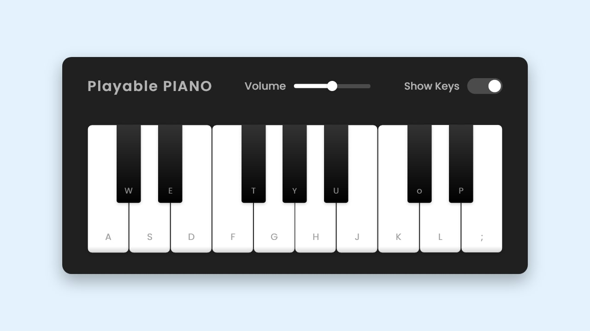

# 🎹 Playable Piano Game

A fun, interactive virtual piano built with **HTML**, **CSS**, and **JavaScript**. Play notes with your **keyboard** or **mouse**. Great for beginners learning music or frontend development!




## 🎮 Features

- 🔤 Keyboard & mouse support  
- 🎼 Realistic piano notes  
- 🎨 Animated key press visual feedback  
- 📱 Responsive design  
- 🎧 Preloaded sound for instant play


## 🚀 Live Demo

🔗 [Click here to play the piano now!](https://nadxgames.netlify.app/piano/)  


## 📂 Project Structure

```Playable-Piano/
├── index.html
├── style.css 
├── script.js 
├── tunes/ 
│ ├── C.wav
│ ├── D.wav
│ ├── E.wav
│ └── ...
├── images/
│ └── piano-preview.png
```


## 🛠️ Built With


## 🧠 How to Use

1. Clone the repository:
   ```bash
   git clone https://github.com/Natthy2023/browser-game-jam.git
   ```
2. Open index.html in your browser.

3. Use your keyboard or click the keys to play.

👨‍💻 Author
Made with ❤️ by NADX

📬 Email: [natnaelasfaw2023@gmail.com](mailto:natnaelasfaw2023@gmail.com)  

💬 Telegram: [@nisimp](https://t.me/nisimp)

📄 License

This project is open-source and free to use for learning and inspiration.

