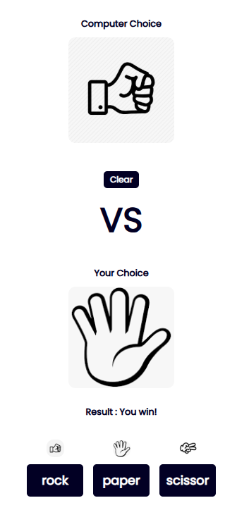

# ✊✋✌️ Rock Paper Scissors Game

A classic **Rock Paper Scissors** game built with vanilla JavaScript. Play against the computer in a simple and interactive browser-based UI.

## 🎮 Features

- 👤 Player vs. 🤖 Computer gameplay
- 🧠 Computer selects randomly each round
- ✅ Tracks and displays player and computer scores
- 🔄 Option to restart/reset the game
- 💻 Built using HTML, CSS, and JavaScript only (no libraries)

## 📸 Demo Preview
 ### Desktop 


### Mobile 

## 🚀 How to Play

1. Choose **Rock**, **Paper**, or **Scissors** by clicking the buttons.
2. The computer will make a random choice.
3. Results and scores are displayed after each round.
4. First to reach a score limit (optional) wins the game!

## 🛠️ Tech Stack


## 📁 Project Structure

```└── Rock-Paper-Scissor
    ├── README.md
    ├── app.js
    ├── images
        ├── default.jpeg
        ├── paper.png
        ├── rock.jpeg
        ├── scissor.jpeg
        └── selection-board.jpg
    ├── index.html
    └── style.css
  ```

## 👨‍💻 Developed By

 **NADX**  
Frontend Developer  
[GitHub](https://github.com/nadx) | [LinkedIn](https://linkedin.com/in/nadx)